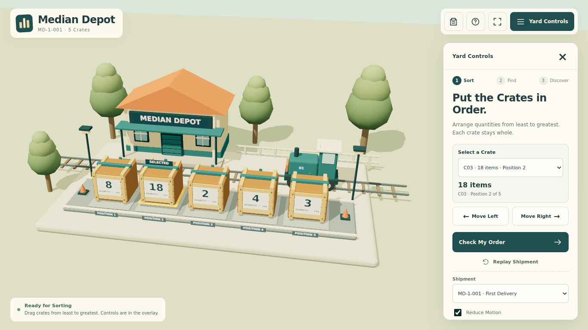

# Median Depot

A 3D classroom game about **median**, set in a warm, cartoony rail yard. Sort intact cargo crates, select the middle observation, and submit its quantity.

The larger shared factory world with **Mean Machine**, pair highlights, and even-count instruction are planned follow-ups.

**Version 0.2.0:** The 3D yard fills the browser window, with collapsible overlay controls and no permanent bottom quantities strip (Issue #11). Built on the sorting-and-odd-median foundation from Issue #1. Two fixed five-crate shipments, including repeated quantities. No account, timer, backend, or runtime CDN required.



## Launch Locally

Install Node.js **22.12 or later**, then run from this repository:

```sh
npm ci
npm run dev
```

Open the local URL printed by Vite, normally `http://127.0.0.1:5173`. Keep that terminal running. Students use a laptop with a modern WebGL2-capable browser; Node is needed on the development/hosting machine. If 3D is unavailable, the accessible HTML controls remain playable.

For a production build:

```sh
npm run build
npm run preview
```

Open the preview URL, normally `http://127.0.0.1:4173`. Serve the generated `dist/` folder with a static HTTP server; opening `index.html` as a local file is not supported.

## Play a Shipment

1. Drag whole crates in the 3D yard, or open **Yard Controls**, choose **Select a Crate**, and use **Move Left** / **Move Right**. Keyboard: Tab to the selector, use arrow keys to choose a crate (Enter to confirm if the native menu requires it), then Tab to a Move button and press Enter or Space.
2. Arrange quantities from least to greatest, then choose **Check My Order**. Equal quantities may be in either order.
3. Select the middle crate. Enter its quantity under **Median Quantity**, then **Submit Median**. The correct value alone does not count if a different crate is selected.
4. **Replay Shipment** restores the exact initial arrival order. **Edit the Order** returns to sorting without changing values.

Crate IDs travel with the crates. **Quantity** is the number inside; **Position** is the crate's current place in the row. Original quantities and IDs are always available in **Shipment Manifest**. That dialog also contains a selectable replay link. **Yard Controls** hides/reopens the overlay without changing order, selection, phase, or a typed answer. Escape hides the overlay when a dialog or native selector is not using that key. **Fullscreen** optionally hides browser chrome; the yard already fills the browser viewport by default. **Reduce Motion** is inside the overlay. All of these controls preserve the current arrangement.

| Shipment Code | Arrival Quantities | Sorted Quantities | Median |
| --- | --- | --- | --- |
| `MD-1-001` | 8, 2, 18, 4, 3 | 2, 3, 4, 8, 18 | 4 |
| `MD-1-002` | 4, 8, 2, 4, 3 | 2, 3, 4, 4, 8 | 4 |

Append `?shipment=MD-1-002` to the launch URL to reproduce that shipment. Codes identify immutable versioned datasets **and arrival order**, not a saved in-progress game. Reload starts fresh. Unknown codes show a notice and use the default. See [Runtime and Launch Decision](docs/RUNTIME.md) for the full contract.

## Classroom Device Target

The teacher's standing target for all educational games is **student laptops**. Prioritize laptop windows, mouse/trackpad input, keyboard access, and readable classroom projection. Phone-specific layouts, screenshots, and testing are outside this project's scope.

On shorter laptop windows the overlay scrolls internally; the page and yard remain fixed to the viewport. The camera frames all five crates in the area clear of the open overlay. Collapse **Yard Controls** for an unobstructed yard.

## GitHub Pages

In repository **Settings → Pages → Build and Deployment**, choose **GitHub Actions** as the source. The included workflow tests and builds PRs, and deploys after a merge to `main` or a manual workflow run on `main`. No deployment occurs from a PR. The final public URL appears in the successful deployment; this README does not claim a deployment has already happened.

## Verify

```sh
npm test
npm run build
npx playwright install chromium
npm run test:browser
```

Tests cover shipment identity, sorting, duplicates, middle-crate selection, rejected answers, replay, data preservation across every permutation, and browser interactions. [Verification Notes](docs/VERIFICATION.md) record actual checks and classroom-device limitations. [Assets and Attribution](docs/ASSETS.md) describes the original procedural art and bundled dependency licenses.

## Start Here

- [Roadmap](ROADMAP.md): build order, issue links, dependencies, and the first classroom release.
- [Design Brief](docs/DESIGN.md): agreed direction, teaching examples, and open choices.
- [Issue #1](https://github.com/AbbyUsesAIThatCodes/MedianDepot/issues/1): scope for the first playable implementation.

## A Shared Factory World

Both games begin outside the same factory in the same cartoon place:

| Game | Camera Destination | Student Action |
| --- | --- | --- |
| Mean Machine | Inside the factory | Redistribute blocks among available bays until every bay has the same amount. |
| Median Depot | Away from the factory entrance toward the rail yard | Sort whole crates and find the middle observation or observations. |

The games are intended to share aesthetics and assets, especially crates. The exact asset-sharing mechanism remains open. This repository records the Median Depot work; companion-repository changes receive their own scoped PR.

## Planned Features

- Example Mode and Challenge Mode.
- Intact-crate sorting, including repeated values as separate observations.
- Toggleable mirrored pair highlights with a distinct middle marker.
- Odd-count median and averaging the two middle values for even counts.
- Stable, replayable shipments.
- Worksheet integration **after** the game is playable.

## Working on the Project

Use focused issues and reviewable PRs, with one implementation handoff at a time. PR descriptions should explain the classroom purpose, changed behavior, verification, and remaining limitations. Refer explicitly to **Issue #N** and **PR #N**.

The roadmap is revisable and is not a release-date promise. Future implementation PRs should add actual launch instructions and keep feature status accurate. Use Title Case for user-facing game titles and interface labels; preserve exact code and repository identifiers.
